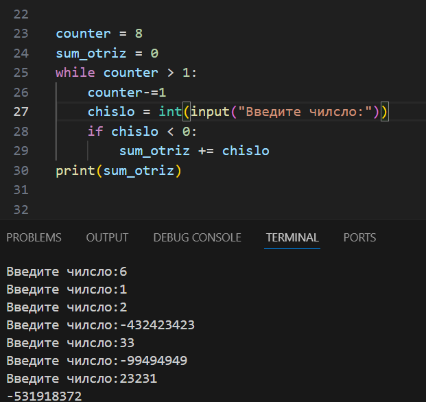

# Python
### My codes

####  In this repository i am going to show my codes

## 1. Electronic diary

## Description

This is an electronic diary where you can display the top best students, display a list of students and give grades. In it I repeated the dictionaries and learned new functions.

* ### 1.1 Adding a mark

* ### 1.2 Conclusion of top students

* ### 1.3 Derive a list of all students

## 2. Game "Guess the number"

## Description

this is a game "Guess the number". There I learned about import and repeated conditional constructions. If the secret number is greater, then it displays the guessed number is greater, and if less, then less, and if you guessed, you will output you guessed. You are given 3 attempts to guess. And if you do not guess after three attempts, then it displays you lose.

* ### 2.1 If the player wins

* ### 2.2 If the player loose

## 3. Other

All other projects were in the learning process. There I learned about data types, operators, conditions, cycles, data structures, and so on.

* ### 3.1 Bubble sort

* ### 3.2  The sum of all negative numbers

* ### 3.3 Positive average temperature in days and their number

